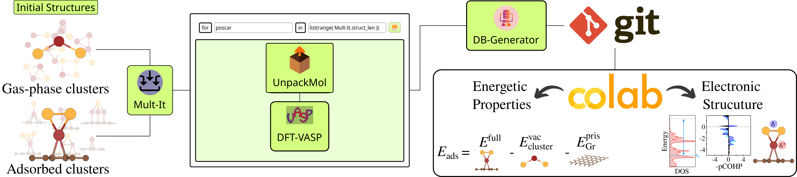

# Au-alloy-supported-on-graphene
Workflow-driven approach for stability and catalytic modulation in the evolution of single-atom catalysts to Au-alloy clusters supported on graphene, as applied in [our work](https://doi.org/10.1038/s41598-025-85891-6).

**Figure 1:** The SimStack workflow framework is used to manage the simulation protocol for calculating the energetic properties and electronic structure of unary and alloy clusters in both gas-phase and adsorbed conditions. The workflow involves several components, each serving a specific function in the process: Mult-It: manages and organizes data lists, UnpackMol: prepares configuration files for DFT calculations, DFT-VASP: carries out Density Functional Theory calculations, DB-Generator: compiles the results into a `yml` file. Additionally, the workflow pushes the `yml` file to a GitHub repository to link the generated data with a Colab notebook, where the results of the simulations are visualized.

# Colab
* Colab notebook for data visualization 

This notebook calculates and provides a preview of the adsorption energy (*Eads*) and excess energy (*Eexc*) in function of composition for clusters in both vacuum (vac) and adsorbed on graphene (ads) conditions. Users can apply it to the data generated in this work or their own datasets, as long as the output folders are named accordingly the `energy.py` requirement. Feel free to modify the code as needed.

# Output File Arrangement
All calculations were performed with Vienna *Ab initio* Simulation Package (VASP), in witch the files follows its syntax. The `converged_structures` folder contains the most stable configurations, written out in the `CONTCAR` file format. It also includes the `INCAR` file used for geometry optimization and the `OUTCAR` file containing only the final energy obtained from self-consistent field (SCF) minimization. Additionally, for evaluating covalent bond contributions through [Crystal Orbital Hamilton Population (COHP)](http://www.cohp.de/) analysis, the `lobsterin` input files used are also provided.

A calculation folder is named as `[condition]_[cluster]_[isomer]_[configuration]`, highlighting key aspects of the system. This structure is based organization of `converged_structures`, which follows:

**condition:** `vac` or `ads`&rarr; **atomicity:** `n_1` ... `n_4` &rarr; **composition:** `ni4`... `ni2au2`...`au4` &rarr; **isomers:** `vac_ni2au2_16`.

For adsorbed conditions, the folder names also include the `configuration`, which indicates the number of contact points (fold) and the geometry, e.g., `ads_ni3au1_30_3f_tetrahedron` represents a tetrahedral cluster with three contact points.

# Scientific Workflow
Our data management was carried out through Workflow Active Nodes (WaNos) within the [SimStack](https://www.simstack.de/) framework, facilitating the efficient handling of a large number of calculations.

## 1.  Mult-It WaNo
Input:
- Configure the path containing `.tar` file with `POSCAR` structures.

Output:
- `file` command name files on the top of the AdvancedFor loop.

## 2. UnpackMol WaNo
Input:
- s

Ouput:
- `POSCAR` files needed to DFT-VASP WaNo.
  
## 3. DFT-VASP WaNo
Input:
- **INCAR tab**: one sets all `INCAR` flags by selecting the popup window options.
- **KPOINTS tab**: one defines two types of KPOINTS, `Kpoints_length` and `Kpoints_Monkhorst.`
- **Analysis tab**: Aimed to compute charge analysis and density of states (DOS).

Ouput:
- `OUTCAR` file.
## 4. DB-Generator
Input:
- **Imports tab**: `Search_in_File` variable should be set as `vasp_results.yml` and import this file using `AdvancedForEach/*/DFT-VASP/outputs/vasp_results.yml` command.
- Search_Parameters: One sets variable to be search, as total energy and title.

Ouput:
- `Table-dict.yml` containing the variables defined in the `Search_Parameters`

## License & Copyright
  Developer: Celso Ricardo C. Rêgo, 
  Multiscale Materials Modelling and Virtual Design,
  Institute of Nanotechnology, Karlsruhe Institute of Technology
  https://www.int.kit.edu/wenzel.php

Licensed under the [KIT License](LICENSE).
